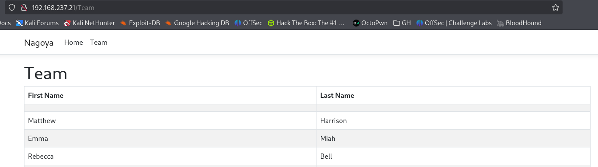
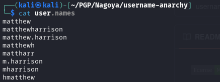

# Info
```bash
Info:
IP: 192.168.237.21
OS:
Domain: nagoya-industries.com
```

# Links:
```bash
https://medium.com/@mu.aktepe18/nagoya-proving-ground-walk-through-afb50d51bb0f

https://aditya-3.gitbook.io/oscp/readme/walkthroughs/pg-practice/nagoya
```
# Standard enum:
```bash
nmap -p- -sCV nagoya.pgp --open
Starting Nmap 7.95 ( https://nmap.org ) at 2025-10-12 20:19 EDT
Nmap scan report for nagoya.pgp (192.168.237.21)
Host is up (0.047s latency).
Not shown: 65512 filtered tcp ports (no-response)
Some closed ports may be reported as filtered due to --defeat-rst-ratelimit
PORT      STATE SERVICE           VERSION
53/tcp    open  domain            Simple DNS Plus
80/tcp    open  http              Microsoft IIS httpd 10.0
|_http-title: Nagoya Industries - Nagoya
|_http-server-header: Microsoft-IIS/10.0
88/tcp    open  kerberos-sec      Microsoft Windows Kerberos (server time: 2025-10-13 00:21:45Z)
135/tcp   open  msrpc             Microsoft Windows RPC
139/tcp   open  netbios-ssn       Microsoft Windows netbios-ssn
389/tcp   open  ldap              Microsoft Windows Active Directory LDAP (Domain: nagoya-industries.com0., Site: Default-First-Site-Name)
445/tcp   open  microsoft-ds?
464/tcp   open  kpasswd5?
593/tcp   open  ncacn_http        Microsoft Windows RPC over HTTP 1.0
636/tcp   open  ldapssl?
3268/tcp  open  ldap              Microsoft Windows Active Directory LDAP (Domain: nagoya-industries.com0., Site: Default-First-Site-Name)
3269/tcp  open  globalcatLDAPssl?
3389/tcp  open  ms-wbt-server     Microsoft Terminal Services
|_ssl-date: 2025-10-13T00:23:20+00:00; 0s from scanner time.
| ssl-cert: Subject: commonName=nagoya.nagoya-industries.com
| Not valid before: 2025-10-12T00:18:05
|_Not valid after:  2026-04-13T00:18:05
| rdp-ntlm-info: 
|   Target_Name: NAGOYA-IND
|   NetBIOS_Domain_Name: NAGOYA-IND
|   NetBIOS_Computer_Name: NAGOYA
|   DNS_Domain_Name: nagoya-industries.com
|   DNS_Computer_Name: nagoya.nagoya-industries.com
|   DNS_Tree_Name: nagoya-industries.com
|   Product_Version: 10.0.17763
|_  System_Time: 2025-10-13T00:22:40+00:00
5985/tcp  open  http              Microsoft HTTPAPI httpd 2.0 (SSDP/UPnP)
|_http-server-header: Microsoft-HTTPAPI/2.0
|_http-title: Not Found
9389/tcp  open  mc-nmf            .NET Message Framing
49666/tcp open  msrpc             Microsoft Windows RPC
49668/tcp open  msrpc             Microsoft Windows RPC
49676/tcp open  ncacn_http        Microsoft Windows RPC over HTTP 1.0
49677/tcp open  msrpc             Microsoft Windows RPC
49681/tcp open  msrpc             Microsoft Windows RPC
49691/tcp open  msrpc             Microsoft Windows RPC
49698/tcp open  msrpc             Microsoft Windows RPC
49717/tcp open  msrpc             Microsoft Windows RPC
Service Info: Host: NAGOYA; OS: Windows; CPE: cpe:/o:microsoft:windows

Host script results:
| smb2-time: 
|   date: 2025-10-13T00:22:41
|_  start_date: N/A
| smb2-security-mode: 
|   3:1:1: 
|_    Message signing enabled and required

Service detection performed. Please report any incorrect results at https://nmap.org/submit/ .
Nmap done: 1 IP address (1 host up) scanned in 210.45 seconds
```


# Worth checking:
```bash
80 - http
139, 445 - smb
389, 636, 3268, 3269 - LDAP
3389 - RDP
5985 - WinRM
9389 - ?
```
# 80
in section team, we have nice finding:


We can sue it to create potential usernames
```bash
Matthew Harrison
Emma Miah
Rebecca Bell
Scott Gardner
Terry Edwards
Holly Matthews
Anne Jenkins
Brett Naylor
Melissa Mitchell
Craig Carr
Fiona Clark
Patrick Martin
Kate Watson
Kirsty Norris
Andrea Hayes
Abigail Hughes
Melanie Watson
Frances Ward
Sylvia King
Wayne Hartley
Iain White
Joanna Wood
Bethan Webster
Elaine Brady
Christopher Lewis
Megan Johnson
Damien Chapman
Joanne Lewis
```
Based on this info, we can start preparing list of potential usernames. To do it, download:
```bash
https://github.com/urbanadventurer/username-anarchy
```

and use thos command (for more, please read github page):
```bash
/username-anarchy -i ~/PGP/Nagoya/usernames >> user.names 
```

Our result:

